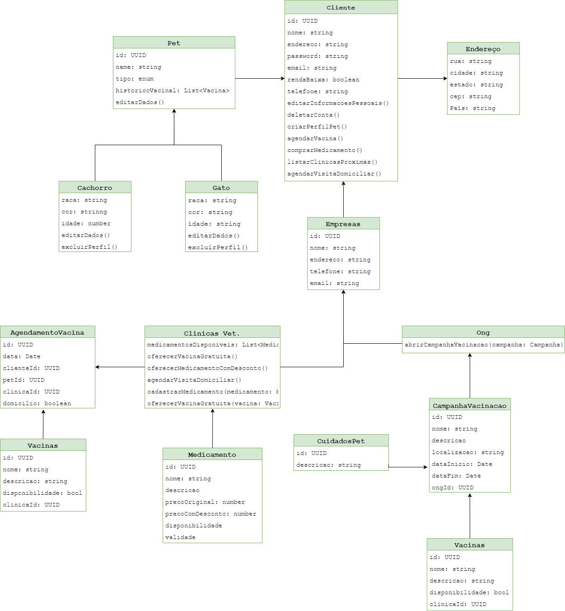

## Introdução

Este projeto é um sistema backend que oferece serviços de vacinação gratuita e medicamentos com desconto para pets, especialmente voltado para usuários de baixa renda. Eles podem criar contas, cadastrar seus pets e visualizar clínicas veterinárias próximas que oferecem esses serviços. O sistema permite ainda o agendamento de visitas domiciliares de veterinários para quem não pode levar o pet até a clínica. O cadastro inclui a descrição do pet e a comprovação de baixa renda do dono. ONGs e programas também podem se cadastrar para oferecer campanhas de vacinação e informações educacionais diretamente na plataforma.

## Contexto
O projeto promove a saúde e o bem-estar dos animais de estimação de pessoas de baixa renda, garantindo que eles recebam vacinação e tratamento médico necessário, o que também impacta De forma positiva a saúde pública. Mesmo que o foco seja em pets, o conceito de garantir que todos tenham acesso a cuidados essenciais, está alinhado com a meta de promover o acesso universal a serviços de saúde. Ao focar em pessoas de baixa renda e fornecer-lhes acesso a serviços que seriam inacessíveis, o projeto contribui para a redução das desigualdades dentro da sociedade.

## Tema
<strong>ODS -> </strong>
Os Objetivos de Desenvolvimento Sustentável (ODS) são uma agenda mundial adotada durante a Cúpula das Nações Unidas sobre o Desenvolvimento Sustentável em setembro de 2015 composta por 17 objetivos e 169 metas a serem atingidos até 2030.
<p align="center">

  
</p>

## Funcionalidades Principais
<strong>CRUD</strong>
* Create (Criar): Usuários podem criar contas, cadastrar seus pets(O cadastro inclui a descrição do pet e a comprovação de baixa renda). 
* Update (Atualizar): Usuários podem atualizar as informações da conta editando dados do pet e da conta.
* Delete (Excluir): Usuários podem deletar a conta.
* Read (Ler): Clínicas veterinárias voluntárias podem ver listas de usuários. 
* Read (Ler): Usuários podem ver a lista de clínicas que oferecem vacinas.
* Create (Criar): Clínicas veterinárias voluntárias e ONGs podem se cadastrar.
* Update (Atualizar): Clínicas veterinárias voluntárias e ONGs podem editar dados.
* Delete (Excluir): Clínicas veterinárias voluntárias e ONGs podem deletar suas contas.
  

## Funcionalidades Secundarias
<strong>CRUD</strong>
* Create (Criar): ONGs podem cadastrar campanhas de vacinação com datas e local.
* Create (Criar): ONGs podem cadastrar informações educacionais sobre cuidados com pets.
* Delete (Excluir): ONGs podem deletar campanhas de vacinação após prazo terminar.
* Delete (Excluir): ONGs podem deletar informações educacionais sobre cuidados com pets.
* Update (Atualizar): ONGs podem editar e atualizar campanhas de vacinação após prazo terminar.
* Update (Atualizar): ONGs podem editar e atualizar informações educacionais sobre cuidados com pets.
* Read (Ler): Usuários podem ver campanhas de vacinação com datas e local.
* Read (Ler): Usuários podem ver informações educacionais sobre cuidados com pets.
* Create (Criar): Clínicas veterinárias podem cadastrar vacinas em estoque.
* Create (Criar): Clínicas veterinárias podem cadastrar remedios com desconto e em estoque para compras.
* Update (Atualizar): Clínicas veterinárias podem atualizar editando dados das vacinas oferecidas.
* Update (Atualizar): Clínicas veterinárias podem atualizar editando dados dos medicamentos para compras.
* Read (Ler): Usuários podem ver a lista de vacinas oferecidas pela clínica.
* Read (Ler): Usuários podem ver a lista de remedios para compras oferecidos pelas clínica.
* Create (Criar): Usuários podem agendar visita domiciliar para vacinação do pet pela clínica.
* Read (Ler): Clínicas podem ver lista de agendamentos domiciliares dos usuários.
* Update (Atualizar): Clínicas podem atualizar agendamentos domiciliares dos usuários.
* Delete (Excluir): Clínicas podem cancelar agendamentos domiciliares dos usuários.
* Delete (Excluir): Usuários podem cancelar visita domiciliar para vacinação do pet pela clínica.

## Modelo Lógico (diagrama de classes)

<p align="center">

</p>

## Arquitetura do Sistema
Padrão de design de design (design pattern) arquitetura hexagonal, arquitetura de portas e adaptadores.
```
src/
|-- domain/
|   |-- models/
|   |-- services/
|   |-- dtos/
|   |--test/
|
|-- app/
|   |-- ports/
|   |   |-- in/
|   |   |-- out/
|   |   |   |-- externalService/
|   |   |--test/
|
|-- infrastructure/
|   |-- adapters/
|   |   |-- controllers/
|   |   |-- database/
|   |   |-- externalService/
|   |-- test/
|-- app.module.ts
|-- main.ts
|
|--.eslintrc.js
|--.gitignore
|--.prettierrc
|--docker-compose.yml
|--Dockerfile
|--nest-cli.json
|--nodemon.json
|--package.json
|--tsconfig.json
```

## Tecnologias utilizadas

* <strong>Typescript</strong>
* <strong>Node</strong>
* <strong>Framework Nestjs</strong>
* <strong>Docker</strong>
* <strong>PostgresSQL</strong>
* <strong>Insomnia</strong>
